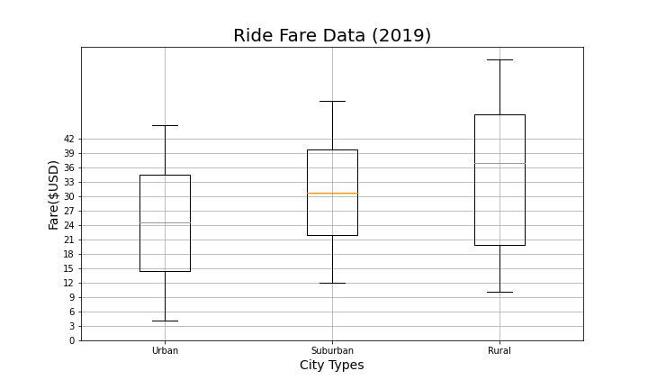
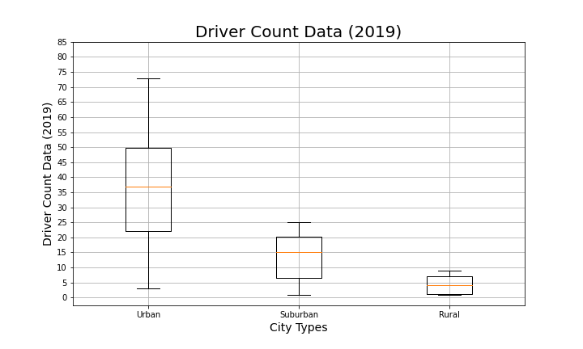
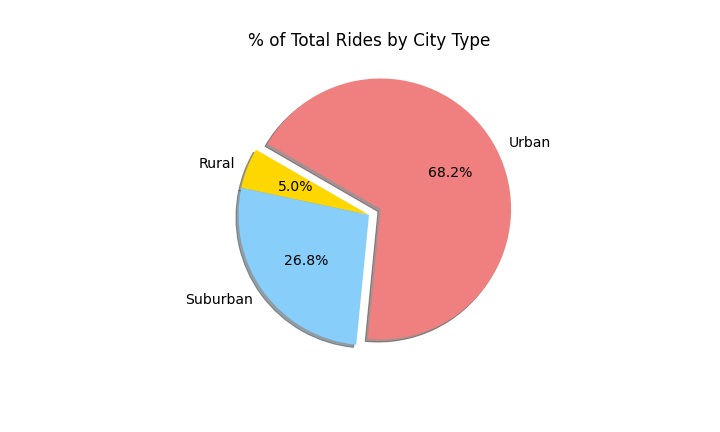
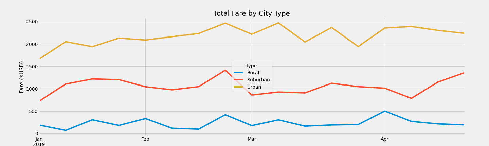

# PyBer Analysis

## Project Overview

A Python-based ride sharing company requested an analysis that showcased the relationship betweeen the type of city (Rural,Urban & Suburban), the number of drivers, riders, and averafe fares, and percentage of total fares, riders and drivers by type of city. This was used to help determine affordability for under served neighborhoods. 

In this analysis, a multiple-line graph was used to display the average fare per week for each type of city.

## Resources
Data Sources: 
- city_data.csv
- ride_data.csv

## Results

Given the graphs above we can conclude the following: 

  - Rural cities has the least amount of drivers, rides and total fares.
  - Urban cities have the most amount of drivers, rides and total fares.
  - Suburban cities are in the middle having the 2nd most drivers, rides and total fares.
  - Rural cities have the highest average fare per ride and per driver.
  - Urban cities have the lowest average fare per ride and per driver.

## Summary

### Summary of Previous Analysis

The data indicates there is a negative correlation between number of drivers, and riders to the average fare of a city dependent on its type. 
The analysis indicated that cities with the greatest number of drivers, and riders, which travel shorter distances as in the case of urban areas, will have the lowest fares. 

### Multiple-line Graph   

The graph indicates consistent trend across the different city types so we can effectively use this to determine average fare on a weekly basis dependent on the type of city.

### Implications 

Given the high number of drivers in urban areas, it is recommended to increase the fees per mile as drivers do not make the same amount of money for number of trips.
Adjust the fees to match number of riders and drivers during certain months.
